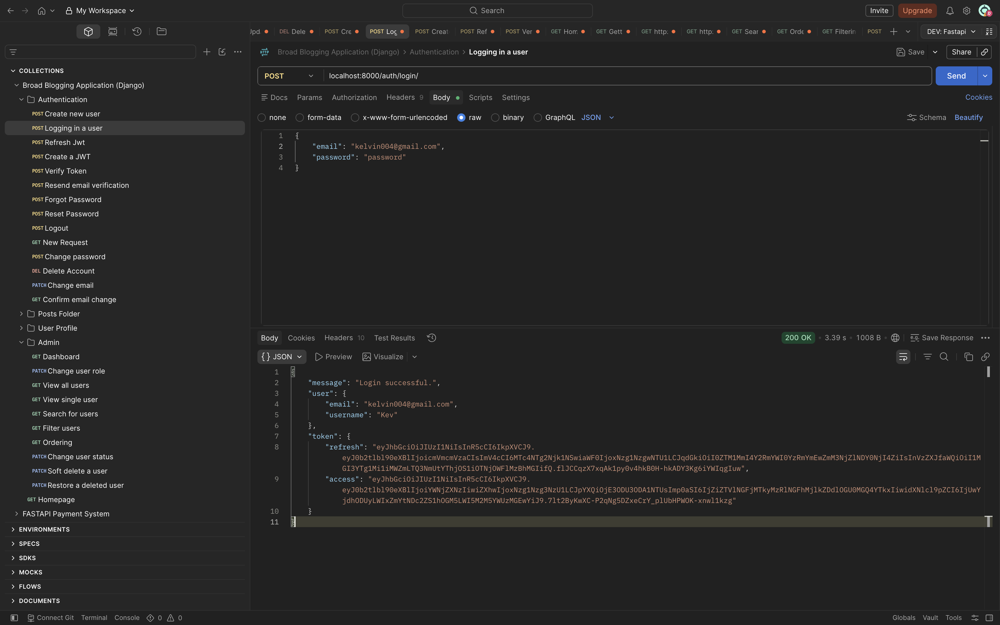
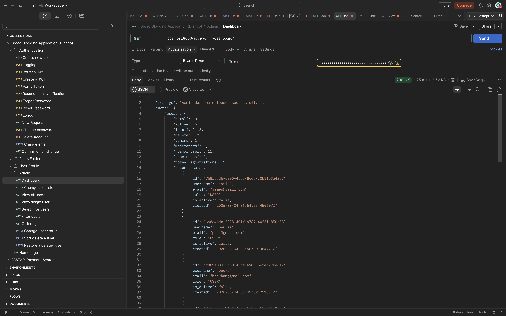
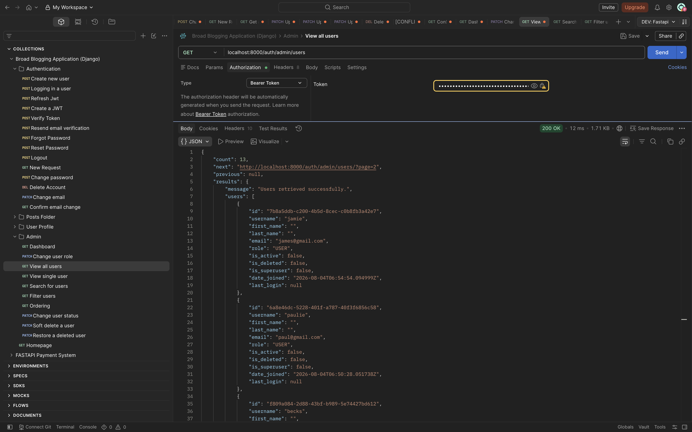
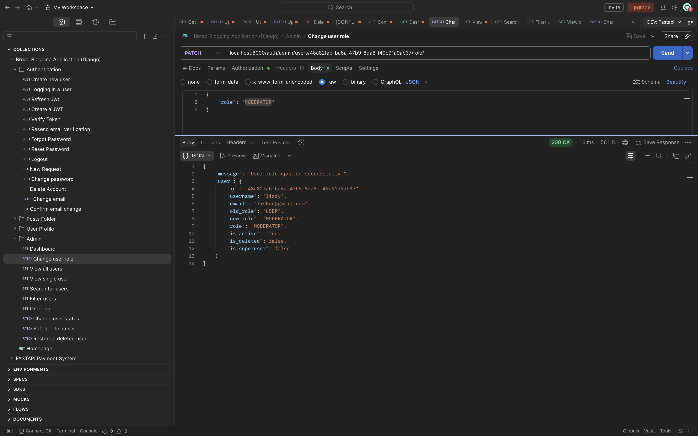
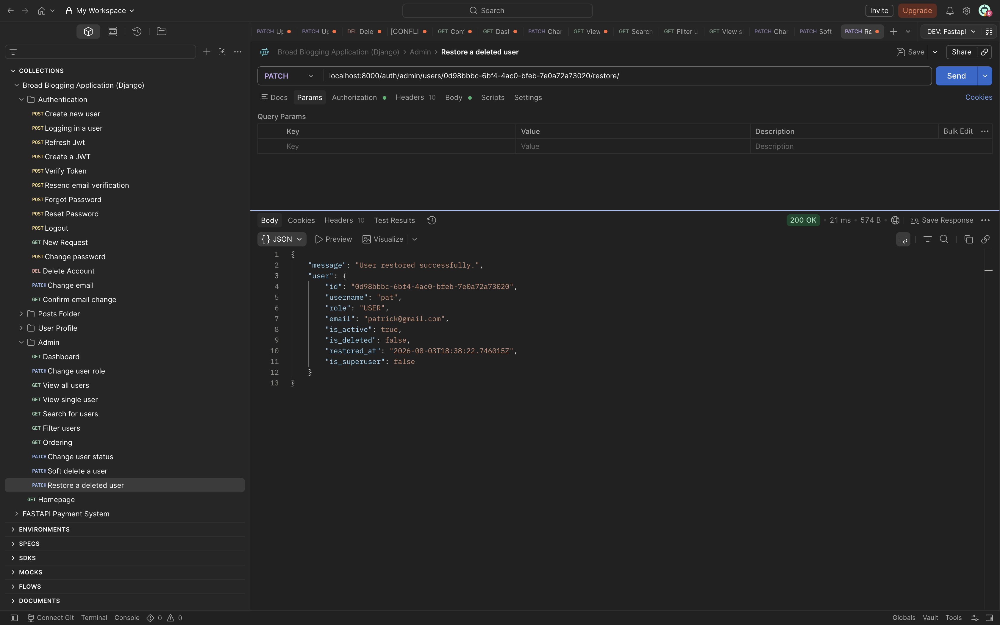

# Broad-Blog-Application

# SimpleGlog REST API

A production-ready RESTful API built with **Django** and **Django REST Framework**, featuring secure JWT authentication, role-based authorization, profile management, email verification, audit logging, and an administrative management system.

This project was built to demonstrate modern backend development practices and serves as a solid foundation for scalable web and mobile applications.


# Screenshots

## Login



---

## Admin Dashboard



---

## User Management



---

## Change User Role



---

## Restore User




---

# Table of Contents

* Features
* Tech Stack
* Project Structure
* Installation
* Environment Variables
* Running the Project
* Authentication
* API Features
* Admin Features
* Audit Logging
* Pagination, Searching & Filtering
* API Response Format
* Future Improvements
* Contributing
* License

---

# Features

## Authentication

* User Registration
* Email Verification
* Resend Verification Email
* Login using JWT
* Refresh Tokens
* Logout
* Forgot Password
* Reset Password
* Change Password
* Change Email
* Confirm Email Change

---

## User Profile

* View Profile
* Update Profile
* Upload Profile Picture
* Upload Files
* Soft Delete Account
* Restore Account

---

## Authorization
Role-based authorization using custom permissions.

# Supported roles:
* User
* Moderator
* Admin
* Superuser

---


## Admin Module

### Dashboard

* Total Users
* Active Users
* Inactive Users
* Deleted Users
* Admin Users
* Moderator Users
* Normal Users
* Superusers
* Today's Registrations
* Total Posts
* Total Audit Logs
* Recent Users
* Recent Audit Logs

---

### User Management

* View All Users
* View Single User
* Search Users
* Filter Users
* Order Users
* Pagination
* Change User Role
* Activate User
* Deactivate User
* Soft Delete User
* Restore User

---

## Audit Logging

Every important action is automatically recorded.

Examples include:

* Login
* Logout
* Registration
* Email Verification
* Password Reset
* Password Change
* Email Change
* Profile Update
* File Upload
* Admin Actions
* User Status Changes
* Role Changes
* Account Restore

Each audit log stores:

* User
* Action
* Status
* IP Address
* User Agent
* Timestamp
* Additional JSON Details

---

# Tech Stack

* Python 3.13
* Django 6
* Django REST Framework
* Simple JWT
* SQLite (Development)
* Token Blacklist
* RESTful API Design

---

# Project Structure


SimpleGlog/
│
├── accounts/
│   ├── models.py
│   ├── serializers.py
│   ├── views.py
│   ├── permissions.py
│   ├── signals.py
│   ├── utils.py
│   └── urls.py
│
├── posts/
│
├── simpleglog/
│   ├── settings.py
│   ├── urls.py
│   └── wsgi.py
│
├── media/
├── manage.py
├── requirements.txt
├── .env.example
└── README.md
```

---

# ⚙️ Installation

Clone the repository.

```bash
git clone https://github.com/Pure-coder007/Broad-Blog-Application.git
```

Enter the project.

```bash
cd simpleglog-api
```

Create a virtual environment.

```bash
python -m venv myvenv
```

Activate it.

### Windows

```bash
myvenv\Scripts\activate
```

### macOS/Linux

```bash
source myvenv/bin/activate
```

Install dependencies.

```bash
pip install -r requirements.txt
```

---

# Environment Variables

Create a `.env` file in the project root.

```env
SECRET_KEY=your-secret-key

DEBUG=True

ALLOWED_HOSTS=127.0.0.1,localhost

DB_ENGINE=django.db.backends.sqlite3
DB_NAME=db.sqlite3

EMAIL_BACKEND=django.core.mail.backends.console.EmailBackend
DEFAULT_FROM_EMAIL=webmaster@localhost

ACCESS_TOKEN_LIFETIME=2
REFRESH_TOKEN_LIFETIME=1

MEDIA_URL=/media/
STATIC_URL=static/
```

---

# Running the Project

Apply migrations.

```bash
python manage.py migrate
```

Create a superuser.

```bash
python manage.py createsuperuser
```

Run the development server.

```bash
python manage.py runserver
```

API will be available at:

```
http://127.0.0.1:8000/
```

---

# Authentication

The project uses **JWT Authentication**.

Include the access token in requests.

```
Authorization: Bearer <your_access_token>
```

---

# Main API Endpoints

## Authentication

| Method | Endpoint                      |
| ------ | ----------------------------- |
| POST   | `/auth/register/`             |
| POST   | `/auth/login/`                |
| POST   | `/auth/logout/`               |
| POST   | `/auth/verify-email/`         |
| POST   | `/auth/resend-verification/`  |
| POST   | `/auth/forgot-password/`      |
| POST   | `/auth/reset-password/`       |
| PATCH  | `/auth/change-password/`      |
| PATCH  | `/auth/change-email/`         |
| GET    | `/auth/confirm-email-change/` |

---

## Profile

| Method | Endpoint                 |
| ------ | ------------------------ |
| GET    | `/auth/profile/`         |
| PATCH  | `/auth/profile/update/`  |
| PATCH  | `/auth/profile/picture/` |
| POST   | `/auth/profile/upload/`  |

---

## Admin

| Method | Endpoint                          |
| ------ | --------------------------------- |
| GET    | `/auth/admin-dashboard/`          |
| GET    | `/auth/admin/users/`              |
| GET    | `/auth/admin/users/<id>/`         |
| PATCH  | `/auth/admin/users/<id>/role/`    |
| PATCH  | `/auth/admin/users/<id>/status/`  |
| PATCH  | `/auth/admin/users/<id>/delete/`  |
| PATCH  | `/auth/admin/users/<id>/restore/` |

---

# Searching

Search users by:

* Username
* Email
* First Name
* Last Name

Example:

```
/auth/admin/users/?search=kelvin
```

---

# Filtering

Examples:

```
?role=ADMIN

?is_active=true

?is_deleted=true

?role=USER&is_active=true
```

---

# Ordering

```
?ordering=username

?ordering=-date_joined

?ordering=email
```

---

# Pagination

Example:

```
?page=2
```

---

# Example Response

```json
{
  "message": "Users retrieved successfully.",
  "count": 8,
  "users": []
}
```

---

# Security

* JWT Authentication
* Password Hashing
* Email Verification
* Token Blacklisting
* Scoped Rate Limiting
* Permission Classes
* Audit Logging
* Soft Deletes

---

# Planned Features

* Device & Session Management
* Two-Factor Authentication (2FA)
* Redis Caching
* Celery Background Tasks
* AWS S3 / Cloudinary Storage
* WebSockets
* Notifications
* Docker
* GitHub Actions CI/CD
* PostgreSQL
* Swagger / OpenAPI Documentation
* Automated Testing
* Production Deployment

---

# Contributing

Contributions, suggestions, and improvements are welcome.

1. Fork the repository.
2. Create a feature branch.
3. Commit your changes.
4. Push the branch.
5. Open a Pull Request.

---

# License

This project is licensed under the MIT License.

---

# Author

**Dike Kingsley**

Backend Developer

If you found this project helpful, consider giving it a ⭐ on GitHub.
